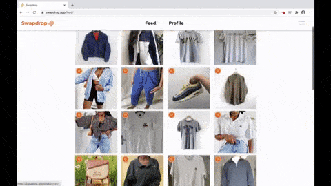
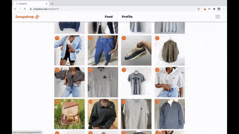

# Swapdrop MVP

I created this website for my brother's startup - Swapdrop. Swapdrop was a platform where users could upload and swap their old clothes seamlessly. To find a match, users made and recieved offers on each other's items until a swap was agreed. At that point, the company carried out the swap on behalf of the users for ultimate convenience and peace of mind. Swapdrop's mission was to enable young people to consume higher quality fashion without breaking the bank or ruining the environment. My brother ultimately ended up closing the company. You can read about why he decided to do so here.

I built this first version of site using Django as I hadn't built a website before and wanted to stick with a language I knew (Python). It tooks around 6 weeks to build. Whilst it served its purpose as an MVP, the site was quite clunky and the codebase was already becoming hard to maintain. When we bought a second developer, [David](https://github.com/Da-byte), on board we decided to build a new version of the website with a decoupled frontend (React) and backend (Django REST framework) so that we could both work on each part separatley. Unfortunatley we never got a chance to finish the second version before the company closed but you can see the code for it [here](https://github.com/lukasmyth96/swapdrop.v2.backend) and [here](https://github.com/lukasmyth96/swapdrop.v2.frontend). 
  

  

  

  

  

  

  

  

